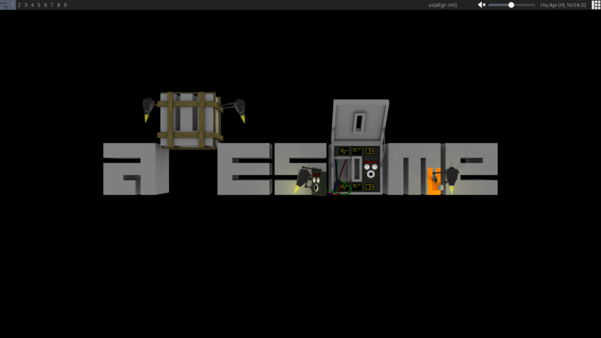

## Somewm config using fennel

### Development  

Using [hererocks](https://github.com/luarocks/hererocks)

```sh
hererocks venv --lua 5.1 --luarocks latest
source venv/bin/activate
```

Building
```sh
luarocks make && somewm
```

<p align="center">
  
</p>
